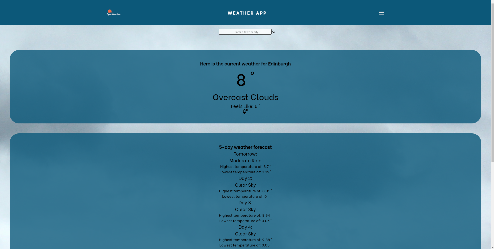
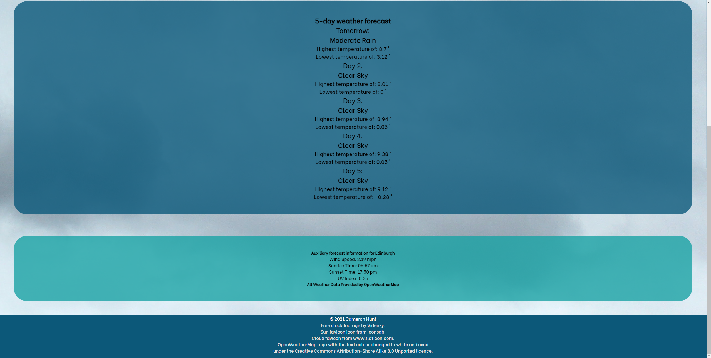
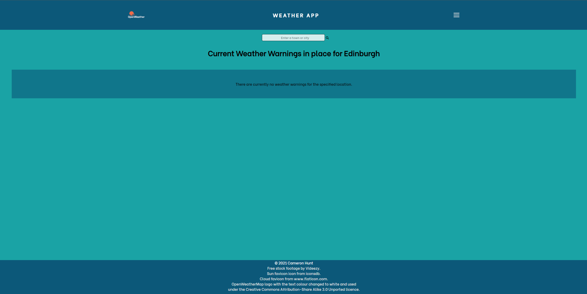
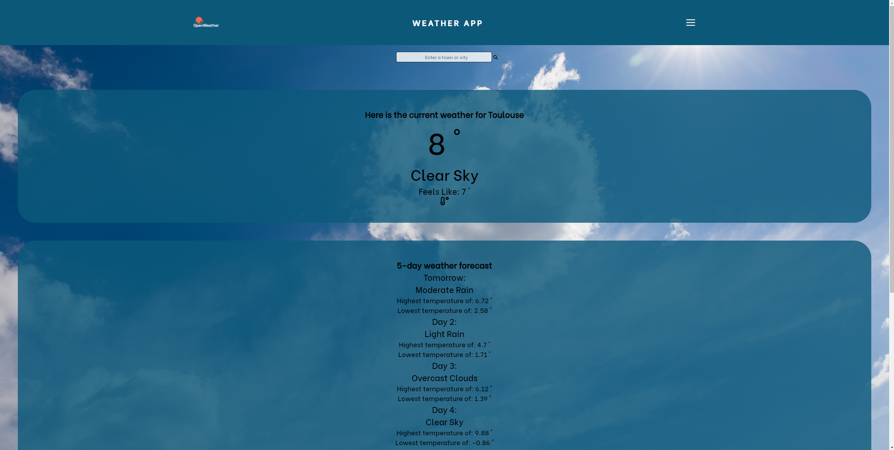
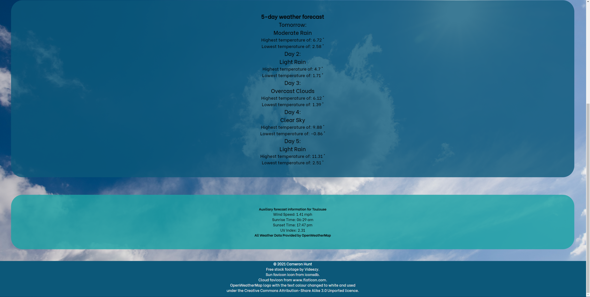
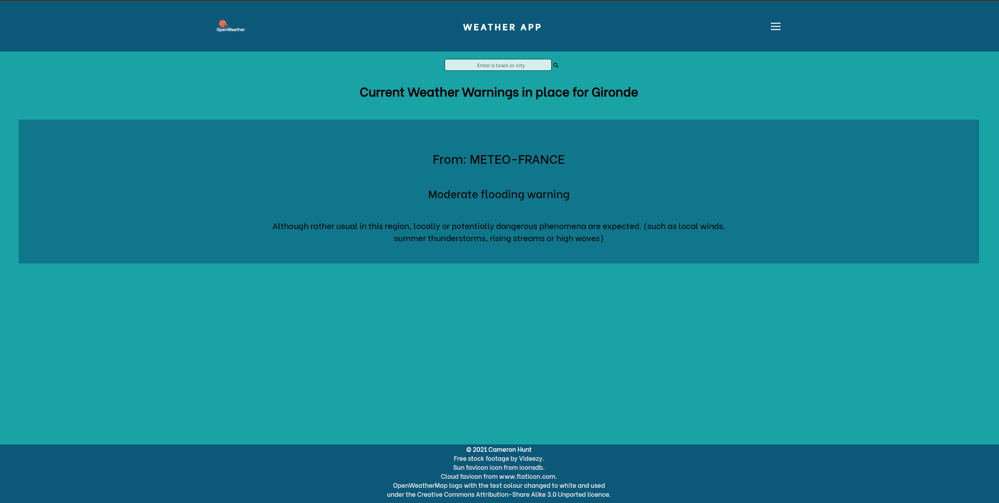
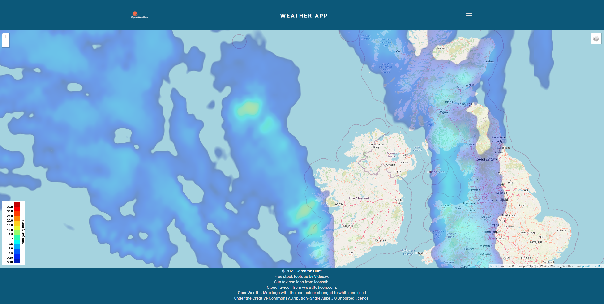
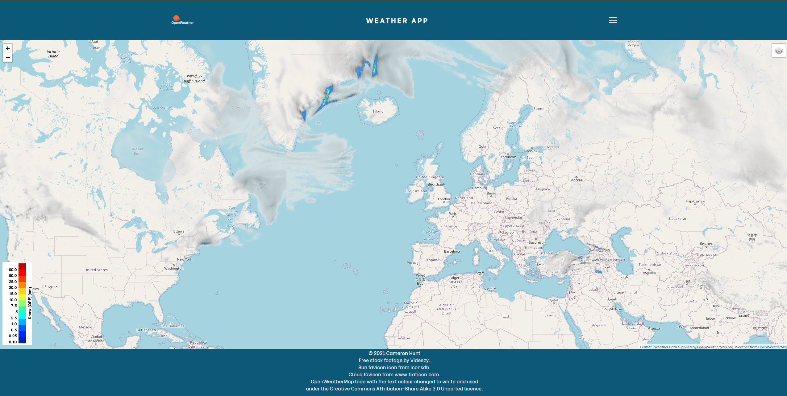
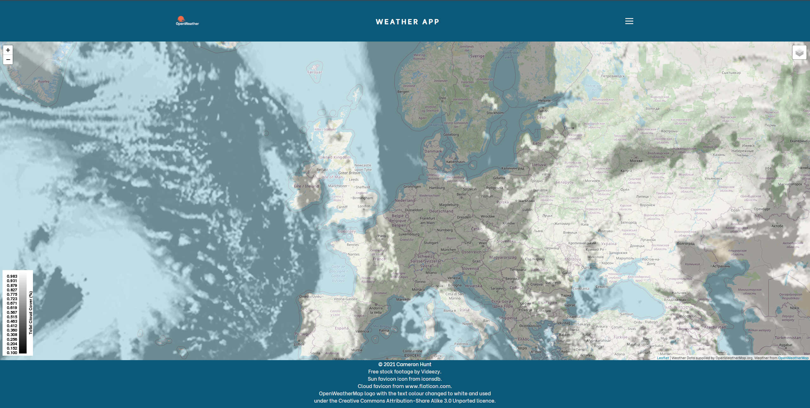
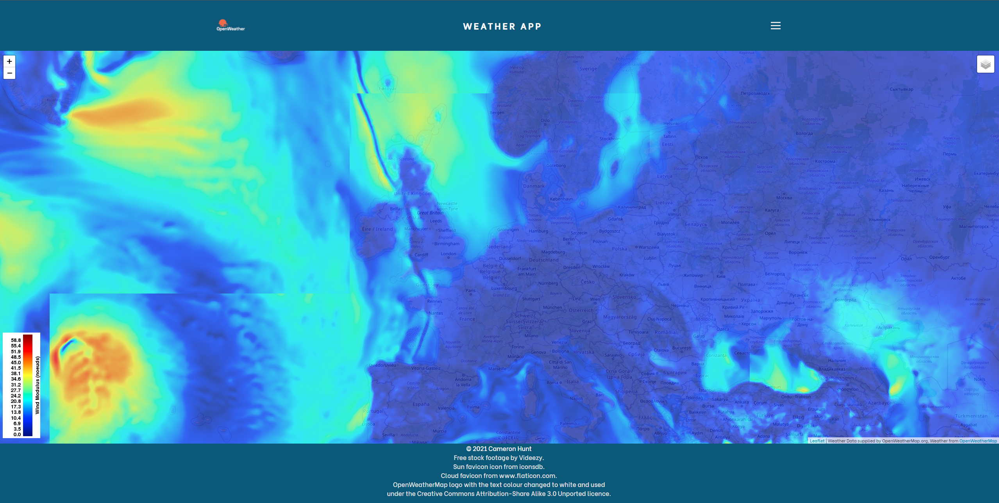

# Server-Side Weather Application Coursework Project for my Advanced Web Technologies Module
## I am using the OpenWeatherMap One Call API:
#### https://openweathermap.org/api/one-call-api

### Weather Report for Edinburgh, UK

### Weather Warnings for Edinburgh, UK

### Weather Report for Toulouse, France

### Weather Warnings for Toulouse, France

### Interactive Weather Map showing areas of rain

### Interactive Weather Map showing areas of snow

### Interactive Weather Map showing areas of clouds

### Interactive Weather Map showing temperature

